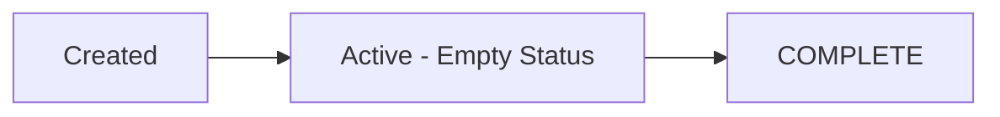

## Overview

The Schedule model represents vessel departure schedules (known as "Dathuru" in Dhivehi). It tracks when vessels depart, which islands they visit, and the status of each scheduled trip. This model is defined in `app/Models/schedule.php` and uses the `schedules` database table.

<Note>
"Dathuru" is the Dhivehi word for schedule, commonly used in the NaaleMV interface to refer to vessel departure schedules.
</Note>

## Database Schema

**Table name**: `schedules`

The schedules table was created by two migrations:
- `database/migrations/2022_10_22_105556_create_schedules_table.php`
- `database/migrations/2022_10_27_110750_add_arr_field_to_schedules.php`

### Fields

<ResponseField name="id" type="integer" required>
  Primary key, auto-incrementing schedule ID
</ResponseField>

<ResponseField name="dep_date" type="date" required>
  Departure date for the scheduled trip
</ResponseField>

<ResponseField name="visiting_to" type="text" required>
  Islands or destinations the vessel will visit on this trip
</ResponseField>

<ResponseField name="dock_island" type="string" required>
  The island where the vessel will dock (departure point)
</ResponseField>

<ResponseField name="vessel_name" type="string" required>
  Name of the vessel for this schedule
</ResponseField>

<ResponseField name="vessel_Contact" type="string" required>
  Contact number for the vessel operator
</ResponseField>

<ResponseField name="status" type="string" nullable>
  Schedule status - can be empty (active), or "COMPLETE" (finished trip)
</ResponseField>

<ResponseField name="created_at" type="timestamp">
  Record creation timestamp
</ResponseField>

<ResponseField name="updated_at" type="timestamp">
  Record last update timestamp
</ResponseField>

## Usage Examples

### Retrieving Active Schedule

From `CustomerController.php:63-67`:

```php
// Get the next active schedule for a vessel
$DepatrueTime = schedule::where([
    ['id', $LastPack->vessel_id],
    ['status', '!=', 'COMPLETE']
])->orderByDesc('id')->first();

// Check if departure time has passed
$DepatrueTime->isDepatured = false;
if($DepatrueTime->dep_date <= $datetime){
    $DepatrueTime->isDepatured = true;
}
```

### Creating a Schedule

From `SettingController.php:36-52`:

```php
// Create a new vessel schedule (dathuru)
$vesselName = vessel::find(auth()->user()->boatid);

schedule::create([
    'dep_date' => $request['DDate'],
    'visiting_to' => $request['VI'],
    'dock_island' => $request['DI'],
    'vessel_name' => $vesselName->name,
    'vessel_Contact' => auth()->user()->contact,
    'status' => "",  // Empty status means active
])->save();
```

### Marking Schedule as Complete

From `SettingController.php:167-187`:

```php
// Mark a schedule as completed
$editingdathuru = schedule::find($id);
$editingdathuru->update([
    'status' => 'COMPLETE'
]);
```

## Relationships

The Schedule model doesn't use explicit Eloquent relationships but is logically connected to:

<Expandable title="Vessel">
  **Type**: Implicit relationship via `vessel_name`
  
  Schedules are linked to vessels by the vessel name string. The vessel information is retrieved from the `vessels` table using the authenticated user's `boatid`.
</Expandable>

<Expandable title="User">
  **Type**: Implicit relationship via `vessel_Contact`
  
  The contact number links back to the vessel operator (User) who created or manages the schedule.
</Expandable>

## Schedule Status Workflow



- **Active** (empty status): Schedule is current and vessel has not completed the trip
- **COMPLETE**: Vessel has completed the scheduled trip

## Common Queries

### Get Incomplete Schedules for a Vessel

```php
$activeSchedules = schedule::where('vessel_name', $vesselName)
    ->where(function($query) {
        $query->where('status', '')
              ->orWhereNull('status');
    })
    ->orderBy('dep_date', 'asc')
    ->get();
```

### Get All Schedules

```php
// Used in customer dashboard to show upcoming departures
$schedules = schedule::orderByDesc('id')->get();
```

### Check if Departure Time Has Passed

```php
$datetime = date('Y-m-d H:i:s');
$schedule = schedule::find($scheduleId);

if ($schedule->dep_date <= $datetime) {
    // Vessel has departed
    $hasDeparted = true;
}
```

## Related Documentation

<CardGroup cols={2}>
  <Card title="SettingController" icon="gear" href="/api/setting-controller">
    View methods for creating and updating schedules
  </Card>
  <Card title="Vessel model" icon="ship" href="/api/models/vessel">
    View the Vessel model that schedules are linked to
  </Card>
  <Card title="Customer guide" icon="user" href="/guides/customers">
    Learn how customers view vessel schedules
  </Card>
  <Card title="Admin settings" icon="sliders" href="/guides/admin-settings">
    Manage vessel schedules as an administrator
  </Card>
</CardGroup>
