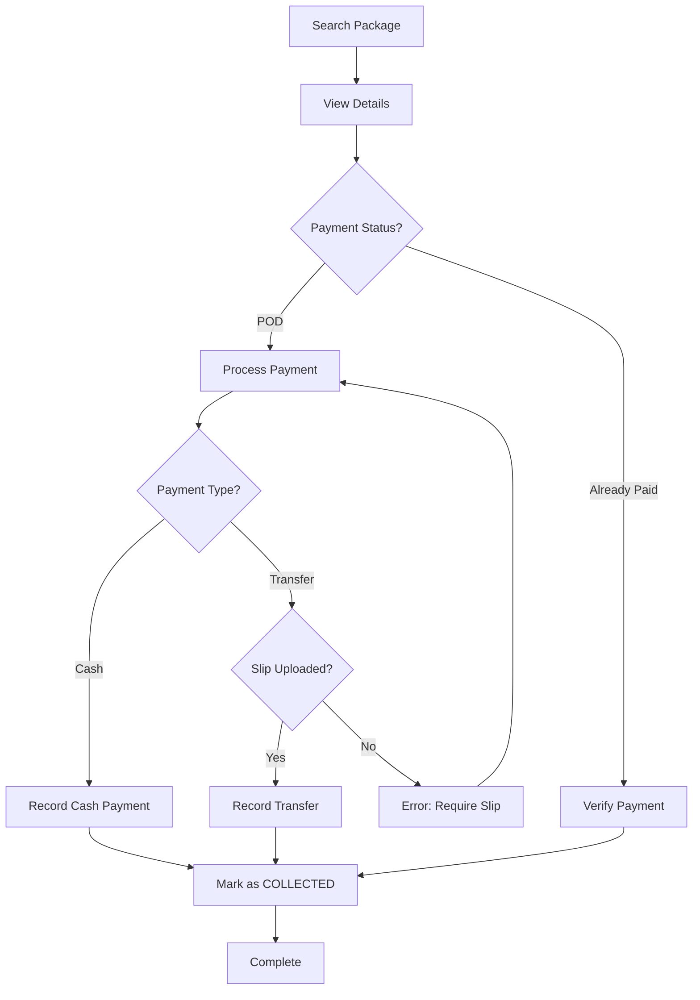

Collection & Delivery manages the final stage of the shipment lifecycle, including payment processing at collection and marking packages as delivered.

## Collection Workflow

The collection process handles payment settlement and package handover:

<Steps>
  <Step title="Locate Package">
    Search for the package using:
    - Package ID
    - Customer address
    - Destination island
    
    ```php
    // CollectionController.php:47-61
    public function search(Request $request)
    {
        $keyword = $request->q;
        
        $result = package::where(function ($query) use($keyword) {
            $query
                ->where('CustAddress', 'like', '%' . $keyword . '%')
                ->orWhere('to', 'like', '%' . $keyword . '%')
                ->orWhere('id', 'like', '%' . $keyword . '%');
        })->get();
        
        return json_decode($result, true);
    }
    ```
  </Step>
  
  <Step title="View Package Details">
    Display complete package information:
    
    ```php
    // CollectionController.php:28-40
    $Total = 0;
    $load = package::with('payment_status')->where('id',$request->packid)->get();
    $laodCustomer = customer::where('id',$load[0]->customer_id)->get();
    $itemsLoaded = shipment::where('packages_id',$request->packid)->get();
    $allCategories = category::all();
    
    foreach($itemsLoaded as $item){
        $Total += $item->unit_price * $item->qty;
    }
    ```
    
    Shows:
    - Customer details
    - All shipment items
    - Payment status
    - Total amount due
  </Step>
  
  <Step title="Process Payment">
    Handle payment based on the selected option (see Payment Options below)
  </Step>
  
  <Step title="Mark as Collected">
    Update package status to COLLECTED:
    
    ```php
    // CollectionController.php:115-117
    package::where('id', $request->packageID)->update([
        'status' => "COLLECTED"
    ]);
    ```
  </Step>
</Steps>

## Payment Options

The system supports three payment methods:

### 1. Payment on Delivery (POD)

Payment will be collected upon delivery:

```php
// CollectionController.php:72-73
if($request->payOption == "POD"){
    return redirect('/clam?packid='.$request->packageID)
        ->with('status_error','Update payment details before Marking collected');
}
```

<Warning>
Packages with POD payment option **cannot** be marked as COLLECTED until payment is processed. The system enforces payment before completion.
</Warning>

### 2. Cash Payment (NOW)

Immediate cash payment at collection:

```php
// CollectionController.php:75-82
if($request->payType == "CASH"){
    $Newreceivables = new receivables([
        'packID' => request('packageID'),
        'paymentType' => Request('payType'),
        'payslip' => '',
        'total' => $request->shipmentTotal
    ]);
    $Newreceivables->save();
}
```

Cash payments:
- Create receivables record immediately
- No payment slip required
- Total amount recorded

### 3. Transfer Payment (NOW)

Bank transfer with payment slip upload:

```php
// CollectionController.php:83-98
if($request->payType == "TRANSFER"){
    if($request->paySlip != null){
        $newPath = time() . "_" . request('packageID') . "." . request('paySlip')->extension();
        request('paySlip')->move(public_path("img"), $newPath);
        
        $Newreceivables = new receivables([
            'packID' => request('packageID'),
            'paymentType' => Request('payType'),
            'payslip' => $newPath,
            'total' => $request->shipmentTotal
        ]);
        $Newreceivables->save();
    } else {
        return redirect('/clam?packid='.$request->packageID)
            ->with('status_error','Please Attach the slip');
    }
}
```

<Note>
Transfer payments **require** a payment slip (bank receipt) to be uploaded. The system will reject the transaction without it.
</Note>

## POD (Payment on Delivery) Handling

### Initial Shipment with POD

When creating a package with POD option:

```php
// PackageController.php:60-85
if($request->payOption != "POD"){
    // Process payment immediately
    if($request->payType == "CASH"){
        $Newreceivables = new receivables([
            'packID' => request('packageID'),
            'paymentType' => Request('payType'),
            'payslip' => '',
            'total' => $request->shipmentTotal
        ]);
        $Newreceivables->save();
    } elseif($request->payType == "TRANSFER"){
        // Handle transfer with slip upload
    }
}

package::where('id', $request->packageID)->update([
    'status' => "LOADED"
]);
```

### Converting POD to Paid

At collection time, POD packages must be converted:

1. Customer arrives to collect package
2. Operator opens package details
3. System shows "POD" status with payment options
4. Operator processes payment (Cash or Transfer)
5. System creates receivables record
6. Package can now be marked as COLLECTED

<Warning>
Attempting to mark a POD package as COLLECTED without payment will result in an error:
"Update payment details before Marking collected"
</Warning>

## Receivables Tracking

All payments are recorded in the receivables table:

```php
// Receivables record structure
$Newreceivables = new receivables([
    'packID' => request('packageID'),      // Package reference
    'paymentType' => Request('payType'),   // CASH or TRANSFER
    'payslip' => $newPath,                 // Image file for transfers
    'total' => $request->shipmentTotal      // Total amount paid
]);
```

### Payment Status Check

Packages are loaded with payment status:

```php
// CollectionController.php:31
$load = package::with('payment_status')->where('id',$request->packid)->get();
```

The `payment_status` relationship:

```php
// package.php:19-22
public function payment_status()
{
    return $this->hasOne(receivables::class, 'packID');
}
```

## Updating Payment Amounts

If the total changes after initial payment:

```php
// CollectionController.php:105-112
if(receivables::where('packID',$request->packageID)->exists()){
    $paydetail = receivables::where('packID',$request->packageID)->first();
    
    if($request->shipmentTotal != $paydetail->total){
        $paydetail->update([
            'total' => $request->shipmentTotal
        ]);
    }
}
```

This handles scenarios where:
- Items were added/removed before collection
- Prices were corrected
- Additional charges applied

## Editing Items at Collection

Operators can edit shipment items during collection:

```php
// CollectionController.php:139-156
public function edit(Request $request, $id)
{
    if($request->submit == "delete"){
        $deleteItem = shipment::find($id);
        if($deleteItem->img_path != 'load_default.png'){
            $fileName = 'item_img/'. $deleteItem->img_path;
            File::delete($fileName);
        }
        $deleteItem->delete();
        return redirect('/create');
        
    } elseif($request->submit == "edit"){
        shipment::where('id', $id)->update([
            'qty' => Request('qty'),
            'unit_price' => Request('unit_price')
        ]);
        return redirect('/clam?packid='.$request->shipmentID);
    }
}
```

<Note>
Editing items at collection allows for last-minute corrections before finalizing the delivery.
</Note>

## Viewing All Collections

Operators can view all packages for their vessel:

```php
// CollectionController.php:21-25
public function index()
{
    $AllPackage = package::where('vessel_id',auth()->user()->boatid)
        ->orderBy('id','DESC')
        ->get();
    return view("collect",['AllPackage'=>$AllPackage]);
}
```

Filtered by:
- Vessel ID (operator's assigned vessel)
- Ordered by most recent first

## Payment Slip Storage

Transfer payment slips are stored with unique filenames:

```php
// Naming pattern
$newPath = time() . "_" . request('packageID') . "." . request('paySlip')->extension();
```

Format: `{timestamp}_{package_id}.{extension}`

Example: `1678901234_42.jpg`

Slips are stored in: `public/img/`

## Collection Status Flow



## Error Handling

### POD Not Processed

```php
if($request->payOption == "POD"){
    return redirect('/clam?packid='.$request->packageID)
        ->with('status_error','Update payment details before Marking collected');
}
```

### Missing Payment Slip

```php
if($request->paySlip == null){
    return redirect('/clam?packid='.$request->packageID)
        ->with('status_error','Please Attach the slip');
}
```

### General Payment Error

```php
else {
    return redirect('/clam?packid='.$request->packageID)
        ->with('status_error','error occured while saving! Try again');
}
```

## Related Features

- [Shipment Management](/features/shipment-management) - Create packages with items
- [Package Tracking](/features/package-tracking) - Monitor package status
- [Customer Management](/features/customer-management) - View customer settlement status

## Best Practices

1. **Verify Contents**: Check all items match the shipment list before marking collected
2. **Payment Documentation**: Always upload clear payment slips for transfers
3. **POD Processing**: Process POD payments promptly at collection
4. **Amount Verification**: Double-check totals match before recording payment
5. **Receipt Provision**: Provide customers with collection confirmation

## Common Collection Scenarios

### Scenario 1: Standard Cash Collection

1. Customer arrives to collect package ID 123
2. Operator searches for package 123
3. Views package details showing POD status
4. Customer pays cash (total: 500)
5. Operator selects "Cash" payment option
6. System creates receivables record
7. Operator marks package as COLLECTED
8. Customer receives package

### Scenario 2: Transfer Payment with Slip

1. Package ready for collection
2. Customer has already transferred payment
3. Customer shows bank receipt
4. Operator selects "Transfer" payment option
5. Uploads photo of bank receipt
6. System saves slip as `1678901234_123.jpg`
7. Creates receivables record with slip reference
8. Marks package as COLLECTED

### Scenario 3: Pre-Paid Package Collection

1. Package was paid during shipment creation
2. Operator searches package
3. System shows payment already recorded
4. Operator verifies customer identity
5. Marks package as COLLECTED immediately
6. No additional payment processing needed

### Scenario 4: Correcting Item Quantities

1. During collection, customer notes incorrect quantity
2. Operator edits shipment item
3. Updates quantity from 3 to 2
4. System recalculates total
5. Updates receivables amount if already paid
6. Processes any payment adjustment
7. Marks package as COLLECTED with correct total