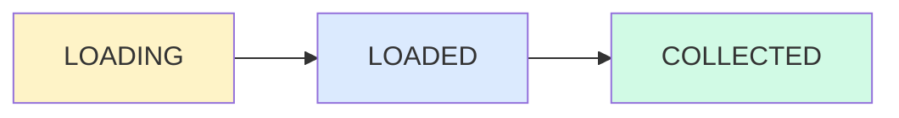

Package Tracking enables customers and operators to monitor shipments through their entire lifecycle from initial loading to final collection.

## Package Status Workflow

Packages move through three primary statuses:



### Status Meanings

<AccordionGroup>
  <Accordion title="LOADING" icon="box-open">
    **Initial Status**: Package is being prepared
    
    - Items are being added to the shipment
    - Customer details are being recorded
    - Payment information may be pending
    - Items can be edited or deleted
    
    This is the default status when a new package is created.
    
    ```php
    // CustomerController.php:38-43
    if($newpackage->status =="LOADING"){
        $NewCustomer = customer::where('id',$newpackage->customer_id)->first();
        Session::put('NewCustomer',$NewCustomer);
        Session::put('newpackage',$newpackage);
        return redirect('/create');
    }
    ```
  </Accordion>
  
  <Accordion title="LOADED" icon="ship">
    **Shipment Ready**: Package is loaded on vessel
    
    - All items have been added and confirmed
    - Payment has been processed (or marked as POD)
    - Package is on the vessel for transport
    - No further edits allowed
    
    Transition occurs when operator finalizes the package:
    
    ```php
    // PackageController.php:88-90
    package::where('id', $request->packageID)->update([
        'status' => "LOADED"
    ]);
    ```
  </Accordion>
  
  <Accordion title="COLLECTED" icon="check-circle">
    **Delivery Complete**: Package has been collected by customer
    
    - Customer has received the package
    - Payment has been settled (if POD)
    - Transaction is complete
    - Package appears in settlement records
    
    Marked when collection is confirmed:
    
    ```php
    // CollectionController.php:115-117
    package::where('id', $request->packageID)->update([
        'status' => "COLLECTED"
    ]);
    ```
  </Accordion>
</AccordionGroup>

## Tracking by Package ID

Every package receives a unique ID for tracking:

### For Operators

Search packages using the collection interface:

```php
// CollectionController.php:47-61
public function search(Request $request)
{
    $keyword = $request->q;
    
    $result = package::where(function ($query) use($keyword) {
        $query
            ->where('CustAddress', 'like', '%' . $keyword . '%')
            ->orWhere('to', 'like', '%' . $keyword . '%')
            ->orWhere('id', 'like', '%' . $keyword . '%');
    })->get();
    
    return json_decode($result, true);
}
```

<Note>
Search functionality supports multiple fields:
- Package ID
- Customer address
- Destination island ("to" field)
</Note>

### For Customers

Customers can view their package status through the dashboard:

```php
// CustomerController.php:54
$LastPack = package::with('VesselName')
    ->where([['customer_id',auth()->user()->custid]])
    ->orderByDesc('id')
    ->First();
```

## Customer Dashboard View

The customer dashboard shows:

1. **Last Package Status**: Most recent shipment with real-time status
2. **Vessel Information**: Which vessel is carrying the package
3. **Departure Time**: Scheduled and actual departure tracking
4. **Transaction Summary**:
   - Total shipments
   - Collected packages
   - In-transit packages

```php
// CustomerController.php:55-68
$transaction = package::where('customer_id',auth()->user()->custid)->orderByDesc('id')->get();
$TransColl = package::where([['customer_id',auth()->user()->custid],['status','COLLECTED']])->get();
$TransShipped = package::where([['customer_id',auth()->user()->custid],['status','!=','COLLECTED']])->get();

$transaction->TotalShipments = count($transaction);
$transaction->Collected = count($TransColl);
$transaction->Shipped = count($TransShipped);

if($LastPack && $LastPack->status != 'COLLECTED'){
    $DepatrueTime = schedule::where([['id',$LastPack->vessel_id],['status','!=','COMPLETE']])->first();
    $DepatrueTime->isDepatured = ($DepatrueTime->dep_date <= date('Y-m-d H:i:s'));
}
```

## Operator Collection View

Operators can view all packages for their vessel:

```php
// CollectionController.php:21-25
public function index()
{
    $AllPackage = package::where('vessel_id',auth()->user()->boatid)
        ->orderBy('id','DESC')
        ->get();
    return view("collect",['AllPackage'=>$AllPackage]);
}
```

<Note>
Packages are filtered by vessel ID to show only packages assigned to the operator's vessel.
</Note>

## Package Details View

When viewing package details for collection:

```php
// CollectionController.php:28-40
public function clam(Request $request)
{
    $Total = 0;
    $load = package::with('payment_status')->where('id',$request->packid)->get();
    $laodCustomer = customer::where('id',$load[0]->customer_id)->get();
    $itemsLoaded = shipment::where('packages_id',$request->packid)->get();
    $allCategories = category::all();
    
    foreach($itemsLoaded as $item){
        $Total += $item->unit_price * $item->qty;
    }
    
    return view("clam",['load'=>$load,'laodCustomer'=>$laodCustomer,
                         'itemsLoaded'=>$itemsLoaded,'allCategories'=>$allCategories,
                         'Total'=>$Total]);
}
```

This view displays:
- Package information with payment status
- Customer details
- All shipment items with categories
- Calculated total amount

## Package Data Structure

Packages contain the following core fields:

| Field | Type | Description |
|-------|------|-------------|
| `id` | Primary Key | Unique package identifier |
| `CustAddress` | String | Delivery address |
| `from` | String | Origin location |
| `to` | String | Destination island |
| `status` | Enum | LOADING, LOADED, or COLLECTED |
| `customer_id` | Foreign Key | Reference to customer |
| `vessel_id` | Foreign Key | Reference to vessel/schedule |

Reference: `package.php:11-18`

## Transaction History

Customers can view their complete transaction history:

```php
// CustomerController.php:79-82
public function transaction()
{
    $transaction = package::where('customer_id',auth()->user()->custid)
        ->orderByDesc('id')
        ->get();
    return view('customer.transaction',['transaction'=>$transaction]);
}
```

## Status Transition Rules

<Warning>
Status transitions are **unidirectional**:
- LOADING → LOADED ✓
- LOADED → COLLECTED ✓
- COLLECTED → LOADED ✗ (Not allowed)
- LOADED → LOADING ✗ (Not allowed)

Once a package moves to the next status, it cannot be reverted.
</Warning>

## Search Functionality

### Empty Search
Returns all packages ordered by status:

```php
if($request->q == ""){
    $result = package::orderBy('status','DESC')->get();
    return json_decode($result, true);
}
```

### Keyword Search
Searches across multiple fields:
- Customer address
- Destination island
- Package ID (exact or partial match)

## Related Features

- [Shipment Management](/features/shipment-management) - Add items to packages
- [Customer Management](/features/customer-management) - View customer transaction history
- [Collection & Delivery](/features/collection-delivery) - Mark packages as collected

## Best Practices

1. **Timely Updates**: Update package status as soon as state changes occur
2. **Search Optimization**: Use package ID for fastest lookup
3. **Customer Communication**: Inform customers when status changes to LOADED or COLLECTED
4. **Verification**: Always verify package contents before marking as COLLECTED

## Common Tracking Scenarios

### Scenario 1: Customer Checks Status

1. Customer logs into dashboard
2. Views "Last Package" section
3. Sees status: LOADED
4. Checks departure time and vessel information
5. Monitors until status changes to COLLECTED

### Scenario 2: Operator Searches Package

1. Customer calls asking about package
2. Operator searches by customer address or package ID
3. Views package details and current status
4. Provides information to customer

### Scenario 3: Bulk Status Review

1. Operator opens collection view
2. Sees all packages for their vessel
3. Filters by status (LOADED packages pending collection)
4. Processes collections systematically