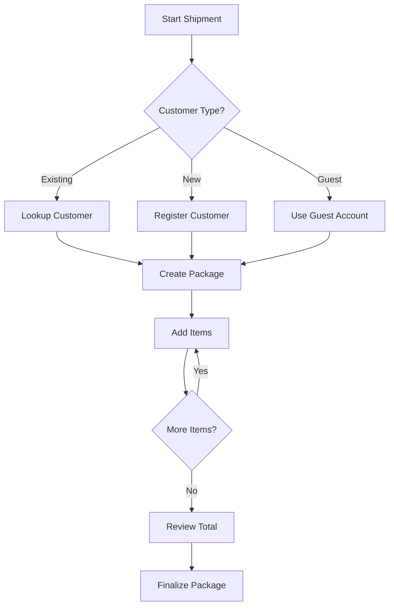

Shipment Management is the core feature for recording individual items within a package. Each shipment item includes category details, quantity, unit price, and optional images.

## Overview

The shipment system allows operators to:
- Add multiple items to a package
- Track item categories, quantities, and prices
- Upload images for each item
- Edit or delete items before finalizing
- Support both customer and guest shipments

## Creating Shipment Items

<Steps>
  <Step title="Select or Create Customer">
    Navigate to the customer lookup page and either:
    - Enter an existing customer number
    - Create a new customer entry
    - Choose "Guest" for anonymous shipments
    
    Reference: `CustomerController.php:122-184`
  </Step>
  
  <Step title="Add Item Details">
    For each item in the shipment, provide:
    - **Category**: Select from predefined categories
    - **Quantity**: Number of units
    - **Unit Price**: Price per unit
    - **Image** (optional): Upload item photo
    
    ```php
    // ShipmentController.php:98-120
    $newShipment = new shipment ([
        'qty' => Request('qty'),
        'unit_price' => Request('unit_price'),
        'img_path' => $newPath,
        'category_id' => Request('cateID'),
        'packages_id' => Request('packID')
    ]);
    $newShipment->save();
    ```
  </Step>
  
  <Step title="Upload Item Image">
    If an image is provided, it's stored with a unique filename:
    
    ```php
    // ShipmentController.php:108-110
    $newPath = time() . "_pack_id_" . Request('packID') . "." . request('img')->extension();
    request('img')->move(public_path("item_img"), $newPath);
    ```
    
    Images are saved to `public/item_img/` with the naming pattern: `{timestamp}_pack_id_{package_id}.{extension}`
  </Step>
  
  <Step title="Review Total">
    The system automatically calculates the total:
    
    ```php
    // ShipmentController.php:30-34
    $Total = 0;
    $Shipments = shipment::where('packages_id', Session::get('newpackage')->id)->get();
    foreach($Shipments as $item){
        $Total += $item->unit_price * $item->qty;
    }
    ```
  </Step>
</Steps>

## Guest Shipments

For quick processing without customer details, the system supports guest shipments:

```php
// ShipmentController.php:122-154
if($request->submit == "AddItem_Guest"){
    // Create or retrieve guest customer (CustNumber = 0)
    $NewCustomer = new customer([
        'CustNumber' => 0,
        'CustName' => "Guest"
    ]);
    
    // Create package for guest
    $newpackage = new package([
        'CustAddress' => "-",
        'from' => "-",
        'to' => "-",
        'customer_id' => $CustID,
        'vessel_id' => auth()->user()->boatid,
    ]);
    $newpackage->save();
}
```

<Note>
Guest shipments use a special customer record with `CustNumber = 0`. This allows quick processing of shipments without full customer registration.
</Note>

## Editing Shipment Items

You can modify item quantities and prices before the package is finalized:

```php
// ShipmentController.php:225-230
if($request->submit == "AddItem"){
    shipment::where('id', $request->cateID)->update([
        'qty' => Request('qty'),
        'unit_price' => Request('unit_price')
    ]);
}
```

<Warning>
Editing is only available while the package status is **LOADING**. Once marked as **LOADED**, items cannot be modified through the shipment interface.
</Warning>

## Deleting Shipment Items

Remove items from a package before finalization:

```php
// ShipmentController.php:218-224
if($request->submit == "delete"){
    $deleteItem = shipment::find($request->cateID);
    $fileName = 'item_img/'. $deleteItem->img_path;
    File::delete($fileName);  // Remove associated image
    $deleteItem->delete();
}
```

<Note>
Deleting a shipment item also removes its associated image file from the server to prevent storage bloat.
</Note>

## Data Structure

Shipment items contain the following fields:

| Field | Type | Description |
|-------|------|-------------|
| `qty` | Integer | Quantity of items |
| `unit_price` | Decimal | Price per unit |
| `img_path` | String | Filename of uploaded image |
| `category_id` | Foreign Key | Reference to category |
| `packages_id` | Foreign Key | Reference to parent package |

Reference: `shipment.php:11-17`

## Workflow Summary



## Best Practices

1. **Image Upload**: Always upload clear images for valuable or fragile items
2. **Accurate Pricing**: Double-check unit prices before adding items
3. **Category Selection**: Use appropriate categories for better reporting
4. **Review Before Finalizing**: Verify all items and totals before marking as LOADED

## Related Features

- [Package Tracking](/features/package-tracking) - Track package status through the delivery lifecycle
- [Customer Management](/features/customer-management) - Manage customer information and history
- [Collection & Delivery](/features/collection-delivery) - Complete the delivery process

## Common Scenarios

### Scenario 1: Multiple Item Shipment

A customer ships 3 boxes and 2 bags:

1. Look up customer by customer number
2. Add first item: Category "Box", Qty: 3, Price: 50
3. Add second item: Category "Bag", Qty: 2, Price: 30
4. System calculates total: (3 × 50) + (2 × 30) = 210
5. Finalize package with payment option

### Scenario 2: Guest Shipment

A walk-in customer without registration:

1. Click "Guest Shipment"
2. Add items with categories and prices
3. System creates temporary guest customer record
4. Process payment and finalize

### Scenario 3: Correcting an Item

You entered wrong quantity:

1. Locate item in the list
2. Click edit
3. Update quantity or price
4. Save changes
5. Total automatically recalculates